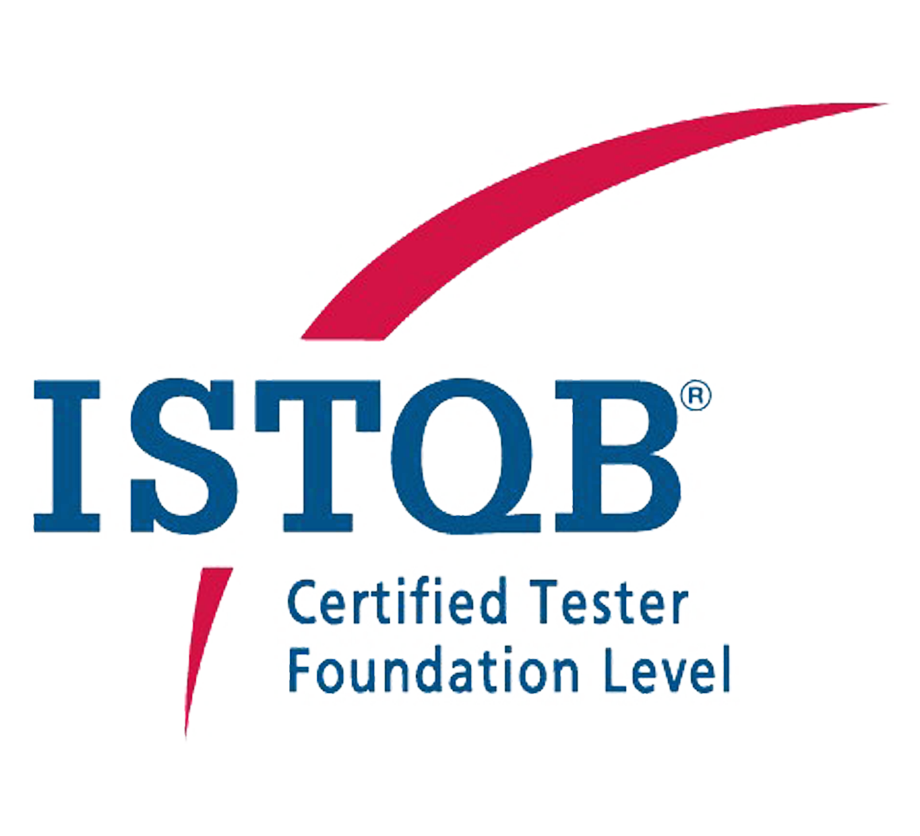

# Hi! My name is Vladimir

---

## About Me
I am a <b>Software Test Engineer</b> with more than 4 years of experience.  
I specialize in ensuring the quality and reliability of software products through thorough testing.  
Here is a short list of my skills:

### Skills
- *Functional testing*
- *Integration and system testing*
- *Regression testing with writing autotests (Robot Framework, Selenium, Playwright)*
- *API testing (Postman, SOAP UI)*
- *SQL testing (MySQL)*
- *Usability testing*
- *ERP testing*
- *Acceptance testing*
- *Writing test artefacts*
- *Writing and testing user scripts*

---

### Resume
[Download my resume](CV_Lashin_Tester_eng.pdf) 

---

### Examples of My Work
Since I cannot show real projects (due to an NDA), I will show my skills using the example of the “Web Shop” training site.

#### Artefacts on Google Drive:
- <a href="https://docs.google.com/document/d/1mu7r23lQwvueH1c_ltrmVmpEzFx3lkqlwZ1kSe0A0x4/edit?usp=sharing" target="_blank">Test Plan</a>
- <a href="https://docs.google.com/spreadsheets/d/1f4Q8VN6Gufj0R72tmPBWx7tXoL7sAcTbXJKIx3ZEtRk/edit?usp=sharing" target="_blank">User Stories</a>
- <a href="https://docs.google.com/spreadsheets/d/1bLJAJp9h3iQc03_BMJ5PXBq2RVoE54kseyUYoxY_feQ/edit?usp=sharing" target="_blank">Checklists and Trace Matrix</a>
- <a href="https://vnlashin-tester.github.io/Mind_Map/markmap.html" target="_blank">Mind Map</a>

#### Project Pages:
- [Manual Test Project #1 with Artefacts and Photos](https://github.com/vnlashin-tester/IND_project) 
- [Project #2 via Robot Framework](https://github.com/vnlashin-tester/RFW_Polteq_WebShop_Lashin)
- [Project #2 via Selenium + PyTest](https://github.com/vnlashin-tester/Selenium_Polteq_WebShop_Lashin)
- [Project #3 via Postman](https://github.com/vnlashin-tester/postman_portfolio): Examples of API tests and scripts via Postman.
- [Example Project 3](https://vnlashin-tester.github.io/vnlashin-tester/under_construction.html): Examples of UI tests via Playwright.
- [Example Project 4](https://vnlashin-tester.github.io/vnlashin-tester/under_construction.html): Examples of SQL tests via MySQL.

---

### Certifications
I was certified by ISTQB and have several other certificates:
- [Page with Certificates](https://github.com/vnlashin-tester/vnlashin-tester/blob/main/CERTIFICATES.md)

---

## Contacts
- [LinkedIn](https://www.linkedin.com/in/vnlashin)
- [Email](mailto:vnlashin@gmail.com)

---

## Skills:

  
  
  
  
  
  
  

